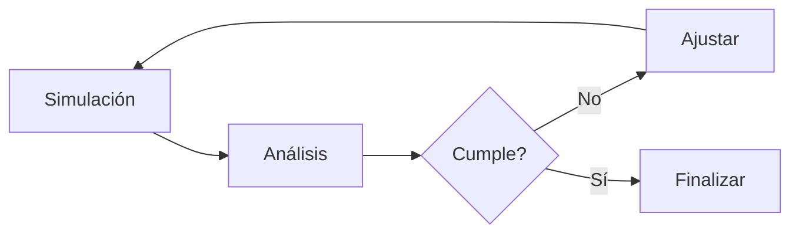

# 📊 Roadmap Análisis de Datos e Inventario - Edwin
## Proyecto Burgh Threads Case Study

---

## 📅 Cronograma General

### Semana 1: Análisis y Procesamiento de Datos
### Semana 2: Estrategia de Inventario
### Semana 3: Implementación y Optimización

---

## 🔷 SEMANA 1: ANÁLISIS Y PROCESAMIENTO

### 📁 Día 1-2: Configuración del Entorno

#### Herramientas Requeridas
- [ ] Excel con Analysis ToolPak
- [ ] R Studio / Python (opcional)
- [ ] Power BI (visualización)

#### Estructura de Carpetas
```
/Análisis_Datos
  ├── /Datos_Originales
  ├── /Datos_Procesados
  ├── /Gráficos
  └── /Tablas_Simio
```

#### Archivos Base
- `Die_Changover_TimeStudy.csv`
- `PickUpDropOffTime.csv`
- `QA_Inspection_Time.csv`
- `SewingStation_TimeStudy.csv`

---

### 📈 Día 3-4: Análisis Estadístico

#### Resumen de Tiempos Procesados

| Proceso | Media | Desv. Est. | Distribución | Expresión Simio |
|---------|-------|------------|--------------|-----------------|
| **Corte** | 20.00 | - | Constante | `20` |
| **Cambio Troquel** | 38.92 | 4.01 | Normal | `Random.Normal(38.92, 4.01)` |
| **Costura T-Shirt** | 7.16 | 2.71 | Normal | `Random.Normal(7.16, 2.71)` |
| **Costura Jeans** | 27.87 | 6.92 | Normal | `Random.Normal(27.87, 6.92)` |
| **Costura Dress** | 11.42 | 2.04 | Normal | `Random.Normal(11.42, 2.04)` |
| **Cambio Hilo** | 7.37 | 1.13 | Normal | `Random.Normal(7.37, 1.13)` |
| **QA/Prenda** | 1.62 | 0.25 | Normal | `Random.Normal(1.62, 0.25)` |
| **Material Handling** | 1.67 | 0.46 | Normal | `Random.Normal(1.67, 0.46)` |

#### Gráficos a Generar
- [ ] Histograma por proceso
- [ ] Box plot comparativo
- [ ] Análisis de variabilidad

---

### 📋 Día 5: Análisis de SKUs

#### Estructura de SKUs (52 productos)
```
3 Diseños × Tallas × Colores = 52 SKUs
├── T-Shirts
├── Jeans
└── Dresses
```

#### Tabla de Análisis

| SKU_ID | Design | Size | Color | Demand/Month | Price | Revenue_Potential |
|--------|--------|------|-------|--------------|-------|-------------------|
| SKU001 | T-Shirt | S | Black | X | $Y | X × Y |
| ... | ... | ... | ... | ... | ... | ... |

---

## 🔷 SEMANA 2: ESTRATEGIA DE INVENTARIO

### 📊 Día 6-7: Cálculos de Inventario

#### Análisis ABC
```
Categoría A (20% SKUs): 80% ingresos → Prioridad Alta
Categoría B (30% SKUs): 15% ingresos → Prioridad Media
Categoría C (50% SKUs): 5% ingresos → Prioridad Baja
```

#### Fórmulas Clave
```excel
Lead_Time = T_Corte + T_Costura + T_QA
Demanda_Diaria = Orders_Per_Month × Number_Per_Order / 20
Safety_Stock = Z × √(Lead_Time) × σ_Demanda
Reorder_Point = Demanda_Lead_Time + Safety_Stock
```

#### Estrategia Inicial por Diseño

| Diseño | Lot Size | Reorder Point | Justificación |
|--------|----------|---------------|---------------|
| **Jeans** | 40-50 | 15-20 | Alto tiempo setup (28 min) |
| **T-Shirt** | 20-30 | 10-15 | Proceso rápido (7 min) |
| **Dress** | 25-35 | 8-12 | Tiempo medio (11 min) |

---

### 🔬 Día 8: Matriz de Experimentos

#### Diseño Factorial
```
Factores:
├── Lot Size: 3 niveles [Bajo, Medio, Alto]
├── Reorder Point: 3 niveles
└── SKU Category: 3 diseños

Total: 27 combinaciones
```

#### Tabla de Experimentos

| Exp_ID | Design | Lot_Size | Reorder_Point | Resultado |
|--------|--------|----------|---------------|-----------|
| 001 | T-Shirt_S | 20 | 10 | Pendiente |
| 002 | T-Shirt_S | 20 | 15 | Pendiente |
| 003 | T-Shirt_S | 30 | 10 | Pendiente |
| ... | ... | ... | ... | ... |

---

## 🔷 SEMANA 3: IMPLEMENTACIÓN Y OPTIMIZACIÓN

### ⚙️ Día 9-10: Integración con Simio

#### Archivo de Parámetros CSV
```csv
SKU_ID,Lot_Size,Reorder_Point,Notes
SKU001,25,12,"T-Shirt Small Black"
SKU002,30,15,"T-Shirt Medium Black"
SKU003,45,18,"Jeans Large Blue"
...
```

---

### 📈 Día 11-12: Dashboard de Resultados

#### Métricas Globales
- **Inventario Promedio Total**: ≤ 1000 unidades ✓
- **Fill Rate Promedio**: ≥ 95% ✓
- **Ingresos Totales**: $XXX

#### Análisis por SKU
| SKU | Fill Rate | Inv. Prom | Stockouts | Status |
|-----|-----------|-----------|-----------|--------|
| SKU001 | 96% | 15 | 2 | ✅ |
| SKU002 | 94% | 22 | 3 | ⚠️ |
| ... | ... | ... | ... | ... |

---

### 🎯 Día 13: Optimización Final

#### Proceso Iterativo



#### Tabla de Iteraciones

| Iteración | Inv_Prom | Fill_Rate | Ingresos | Acción |
|-----------|----------|-----------|----------|---------|
| 1 | 1150 | 92% | $45,000 | Reducir lotes |
| 2 | 980 | 94% | $47,000 | Ajustar ROP |
| 3 | **995** | **96%** | **$48,500** | ✅ Óptimo |

---

## 📦 Entregables Finales

### Estructura de Archivos
```
/Entrega_Edwin
├── 📊 Análisis_Tiempos.xlsx
├── 📈 Dashboard_Métricas.xlsx
├── 📋 Parámetros_Optimizados.csv
├── 📑 Documentación_Metodología.pdf
└── 🎯 Recomendaciones_Finales.docx
```

### Checklist Final
- [ ] Análisis estadístico completo
- [ ] Gráficos y visualizaciones
- [ ] Parámetros optimizados (52 SKUs)
- [ ] Dashboard con métricas
- [ ] Documentación de decisiones
- [ ] Archivo para importar a Simio

---

## ⚡ Tips Críticos

1. **Documentación**: Justificar cada distribución elegida
2. **Validación**: Verificar restricciones en cada iteración
3. **Comunicación**: Compartir hallazgos con el equipo
4. **Respaldo**: Versionar todos los archivos
5. **Preparación**: Tener respuestas para la defensa

---

## 📞 Puntos de Sincronización con el Equipo

| Día | Entregable a Compartir | Con Quién |
|-----|------------------------|-----------|
| 4 | Distribuciones de tiempo | Henry & Erick |
| 8 | Parámetros iniciales | Todo el equipo |
| 11 | Resultados primera corrida | Kevin & Manuel |
| 13 | Parámetros finales | Henry & Erick |

---

*Última actualización: Preparado para proyecto Burgh Threads*